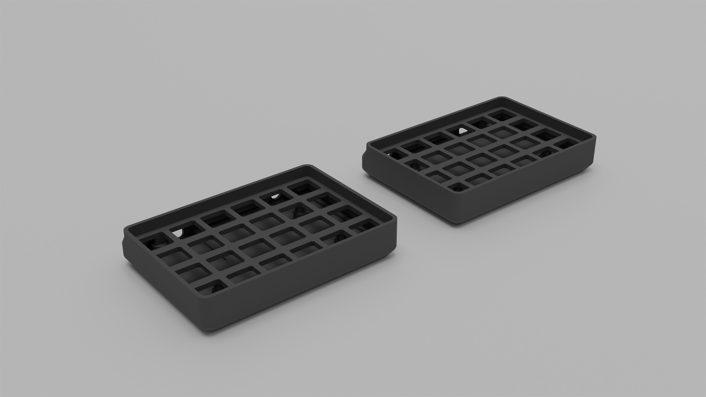
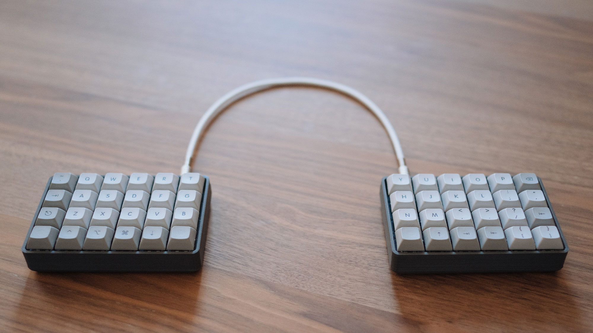

# Hi-Pro Let's Split Case

This is a 3D printable case for [Let's Split](https://github.com/nicinabox/lets-split-guide) style keyboards. I designed it so that it is *just* printable in a 120mm x 120mm build volume, so that it would be printable on my MP Select Mini.

It prints in four pieces. The tops require supports, though I printed the bottoms with supports too. The USB cutouts are large enough to support a USB-C Elite-C or a traditional Pro Micro micro-USB controller. I went with an Elite-C on the left board and Pro Micro on the right.

Switches and PCBs mount directly in the case (no plates). The only mounting hardware required are four M2x10 screws and some rubber feet.

